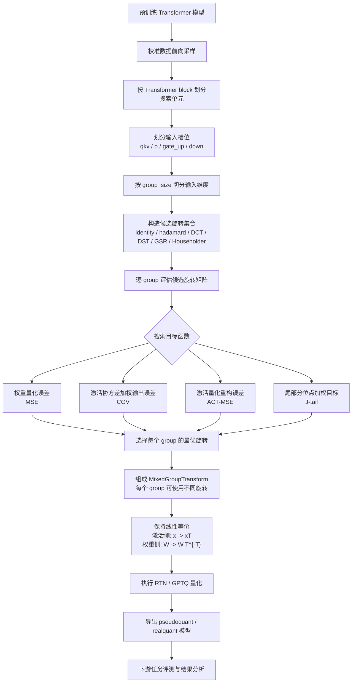

# Group-wise 旋转搜索算法总体流程图

## 图示说明

该流程图概括了当前项目中 group-wise 旋转搜索的核心实现。算法以 Transformer block 为基本单位，将线性层输入划分为 `qkv`、`o`、`gate_up` 和 `down` 四类槽位，并在每个槽位内按量化 group 对输入维度分块。对于每个 group，算法在结构化正交变换候选集合中搜索最优旋转矩阵。

搜索目标支持四类形式：`MSE` 关注权重量化误差，`COV` 使用校准激活协方差近似局部输出扰动，`ACT-MSE` 直接衡量旋转后激活的量化重构误差，`J-tail` 在基础目标上加入分位点尾部加权项。最终，各 group 的最优旋转被组合为 `MixedGroupTransform`，并通过激活侧旋转与权重侧逆变换折叠保持线性等价，再进入 RTN 或 GPTQ 量化流程。
